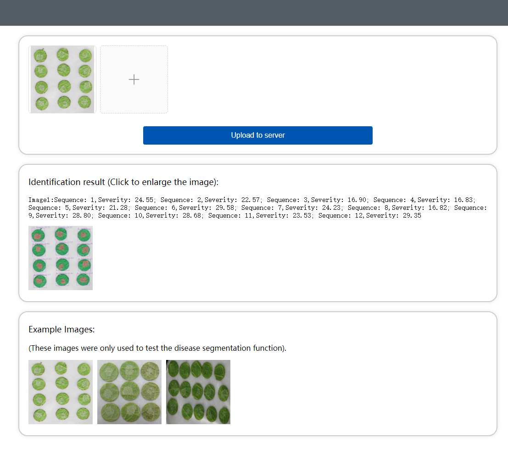
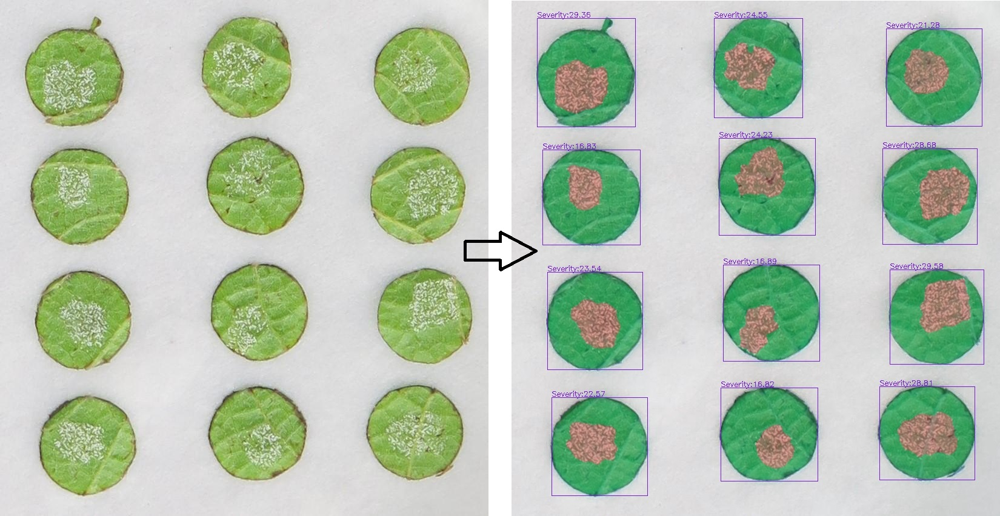
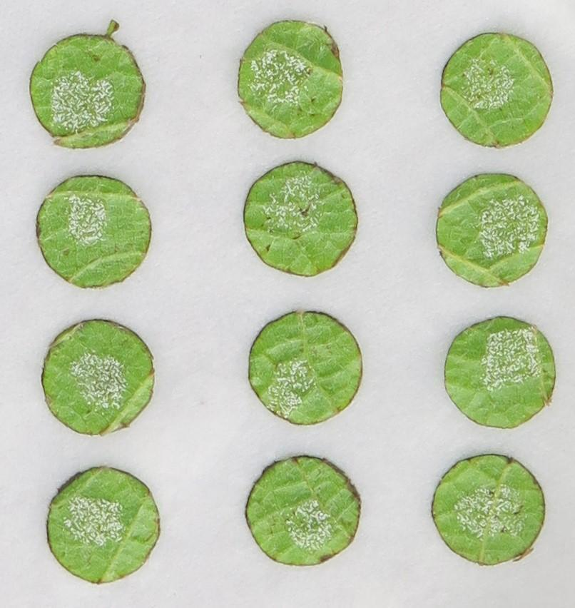
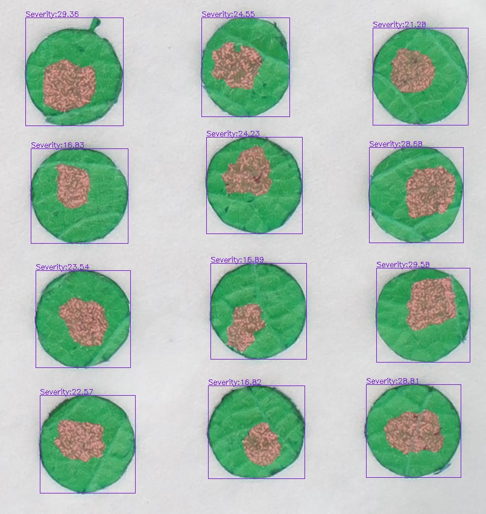

<h3>Automate Grape leaf disc diagnosis for downy mildew sporulation </h3>

High precision, low-cost phenotyping system for leaf diseases diagnosis with deep learning application
Qi Tian, Gang Zhao*, Junjie Qu, Ling Yin, Shumei Wei, Jing Wang, Qiang Yu* 
in <strong>*some juournal*</strong> 

### The online Platform for leaf disc diagnosis 

###  Input and Output 

<!-- 

 -->

